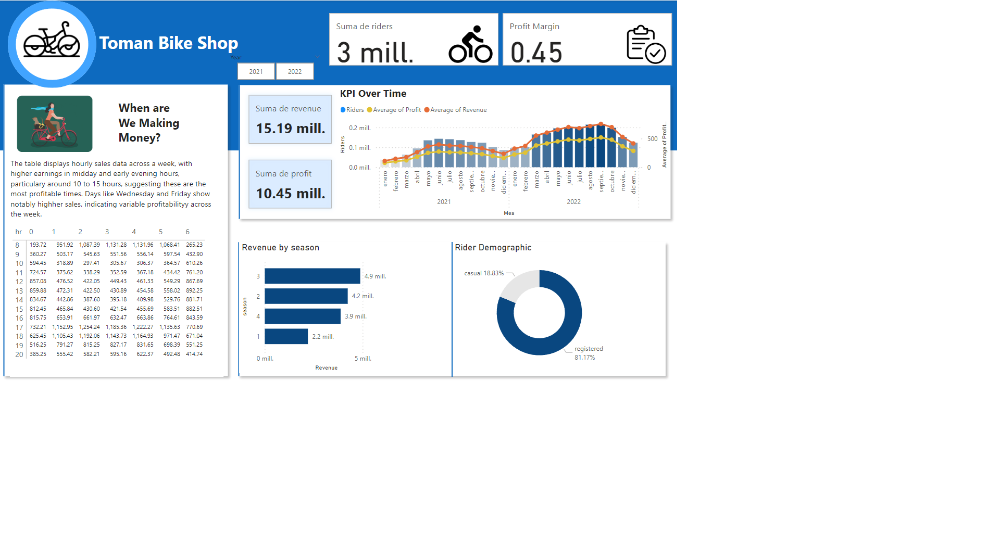

# Power BI report

## When are we making money?

The table displays hourly sales data across a week, with higher earnings in miday and early evening hours, particulary around 10 to 15 hours, suggesting these are the most profitable times. Days like Wednesday and Friday show notably highher sales, indicating variable profitability across the week.

## Recommendation

Conservative Increase: Considering the substantial increase last year, a more conservative increase might be prudent to avoid hitting a price ceiling where demand starts to drop. An increase in the range of 10-15% could test the market's response without risking a significant loss of customers.

**Price Setting:**
- If the price in 2022 was $4.99, a 10% increase would make the new price about $5.49.
- A 15% increase would set the price at approximately $5.74.

**Recommended Strategy:**
**Market Analysis:** Conduct further market research to understand customer satisfaction, potential competitive changes, and the overall economic enviroment. This can guide whether leaning towards the lower or higher end of the suggested increase. 
**Segmented Pricinig Strategy:** Consider different pricing for casual versus registered users, as they may have different price sensitivities.
**Monitor and Adjust: Implement the new prices but be ready yto adjust based on immediate customer feedback and sales data. Monitoring closely will allow you to fine-tune your pricing strategy without committing fully to a price that might turn out to be too  high. 

